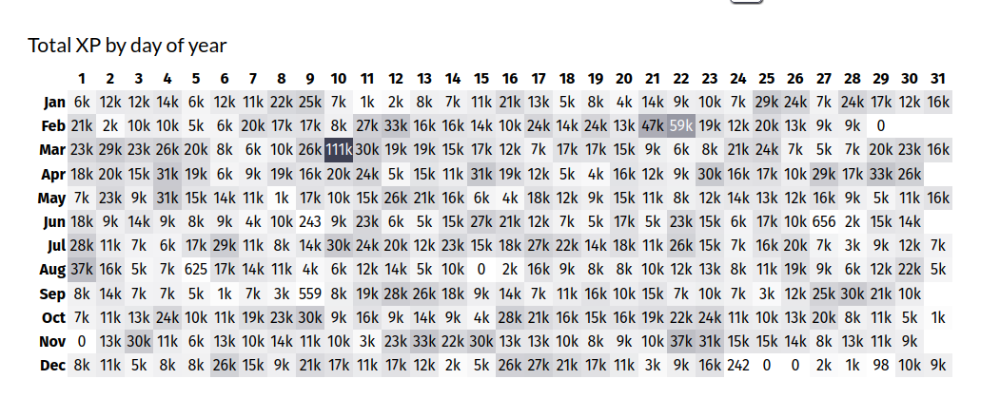
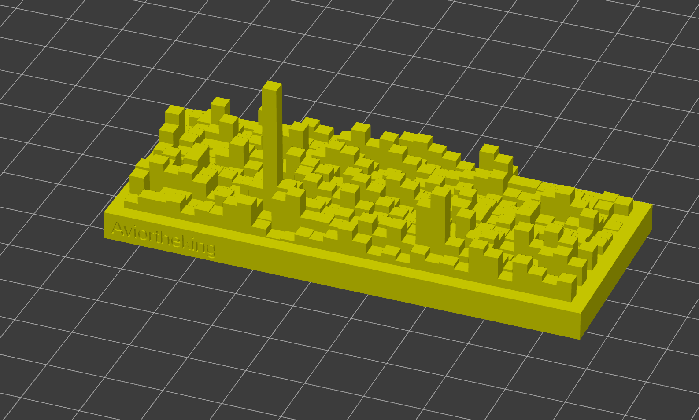

# Code::Stats Skyline

Tool to generate an STL using your Codestats Total XPs

[Based on Github's Skyline](skyline.github.com)

[Idea by @ColinM#7415](https://discord.com/channels/510060567298310144/510060567298310146/1049790442964783114) on the [Code::Stats Discord](https://discord.gg/gyzRfjc)

| Source                       | Result                         |
|------------------------------|--------------------------------|
|  |  |

## How to generate

Go to the following URL and appends your username like below

```
https://codestats-skyline.avior.me/?username=Aviortheking
```

It will generate and allows you to download the generated STL!

## Deploy the tool yourself!

You can use the Dockerfile to deploy the tool yourself!

_Code will be refactored as it has been done quickly :p_